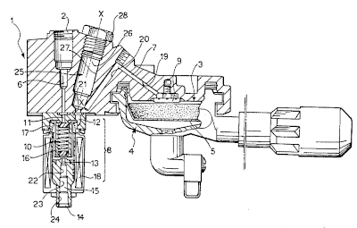

# espresso

[![Build status][workflow-badge]][workflow]
![No Std][no-std-badge]

AT based driver crate for ESP8266 WiFi modules.

This is still very much work in progress.

## Supported Firmware Versions

This driver is being developed for the following firmware version:

    AT+GMR
    AT version:1.7.5.0(Oct 20 2021 19:14:04)
    SDK version:3.0.5(b29dcd3)
    compile time:Oct 20 2021 20:13:50
    Bin version(Wroom 02):1.7.5

You can update your ESP8266 module over WiFi using the "AT+CIUPDATE"
command.

## Resources

- [ESP8266 AT Instruction Set](https://www.espressif.com/sites/default/files/documentation/4a-esp8266_at_instruction_set_en.pdf)
- [ITU V.250 specification ("AT Commands")](https://www.itu.int/rec/T-REC-V.250-200307-I/en)

## License

Licensed under either of

 * Apache License, Version 2.0 ([LICENSE-APACHE](LICENSE-APACHE) or
   http://www.apache.org/licenses/LICENSE-2.0)
 * MIT license ([LICENSE-MIT](LICENSE-MIT) or
   http://opensource.org/licenses/MIT) at your option.

### Contribution

Unless you explicitly state otherwise, any contribution intentionally submitted
for inclusion in the work by you, as defined in the Apache-2.0 license, shall
be dual licensed as above, without any additional terms or conditions.

<!-- Badges -->
[workflow]: https://github.com/dbrgn/espresso/actions?query=workflow%3A"Continuous+integration"
[workflow-badge]: https://github.com/dbrgn/espresso/workflows/Continuous%20integration/badge.svg
[no-std-badge]: https://img.shields.io/badge/no__std-yes-blue
